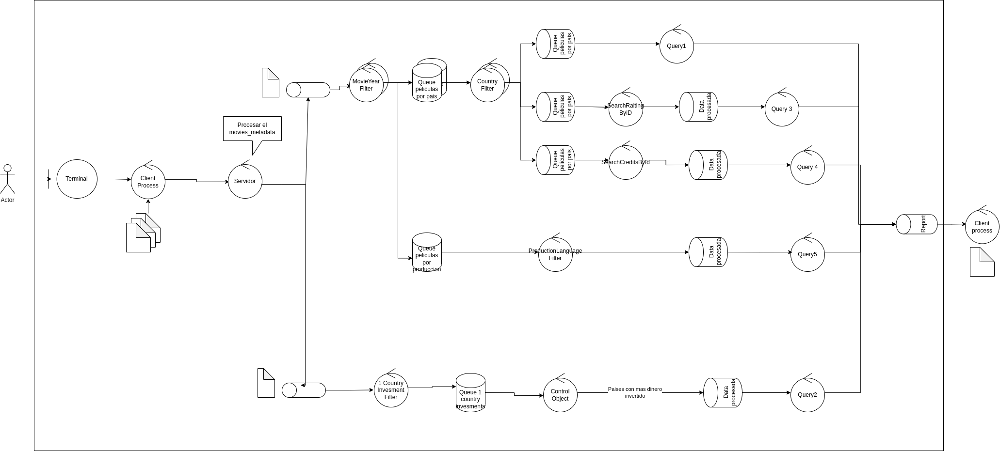

# Enunciado

## Requerimientos funcionales

Se solicita un sistema distribuido que analice la información de películas y los ratings de sus espectadores en plataformas como iMDb.
Los ratings son un valor numérico de 1 al 5. Las películas tienen información como género, fecha de estreno, países involucrados en la producción, idioma, presupuesto e ingreso.
Se debe obtener:
1. Películas y sus géneros de los años 00' con producción Argentina y Española.
2. Top 5 de países que más dinero han invertido en producciones sin colaborar con otros países.
3. Película de producción Argentina estrenada a partir del 2000, con mayor y con menor promedio de rating.
4. Top 10 de actores con mayor participación en películas de producción Argentina con fecha de estreno posterior al 2000
5. Average de la tasa ingreso/presupuesto de peliculas con overview de sentimiento positivo vs. sentimiento negativo, para películas de habla inglesa con producción americana, estrenadas a partir del año 2000

## Requerimientos no funcionales

- El sistema debe estar optimizado para entornos multicomputadoras
- Se debe soportar el incremento de los elementos de cómputo para escalar los volúmenes de información a procesar
- Se requiere del desarrollo de un Middleware para abstraer la comunicación basada en grupos.
- Se debe soportar una única ejecución del procesamiento y proveer graceful quit frente a señales SIGTERM.

## Datos necesarios

Para construir la simulacion: https://www.kaggle.com/datasets/rounakbanik/the-movies-dataset

Valores como resultados patron: https://www.kaggle.com/code/gabrielrobles/fiuba-distribuidos-1-the-movies

# Diseno

#### Diagrama de robustez

Se genero este diagrama de robustez

El diagrama representa la comunicacion e interaccion de mensajes entre nodos. El boundary object que se define es la Terminal. El cliente envia todos los datos (los 3 archivos csv) al servidor(Middleware?). Este nodo de tipo cleaner procesa el documento movies_metadata.csv el cual es el que contiene la informacion principal, y les comunica el procesamiento a otros 2 nodos. 
Siguiendo el flujo por el camino superior, este nodo de tipo filter filtra los datos por el anio correspondiente (en este caso anio 2000). Es multiproceso porque puede ser invocado para hacer distintos filtros.
Otro nodo de tipo filter toma los datos y los filtra por el Pais correspondiente.
Aca ya la Query 1 estaria completada. Este nodo de tipo sink recibe los datos y los almacena en el pipeline que contiene la informacion que se le va a enviar al cliente.

Para las Querys 3 y 4 se tienen sus respectivos nodos de tipo joiner conecta los datos recibidos por con los de los archivos raitings.csv y credits.csv con sus filtros correspondientes a cada Query. Luego se tienen nodos de tipo sink que guardan la respuesta de las Queries

Para resolver la Query 5 y la 2 se utiliza el mismo concepto pero aplicando los filtros correspondientes.

LEER Y ARREGLAR

#### Diagrama de despliegue

#### Diagrama de actividades

#### Diagrama de paquetes

#### Diagrama de secuencia

#### DAG

...